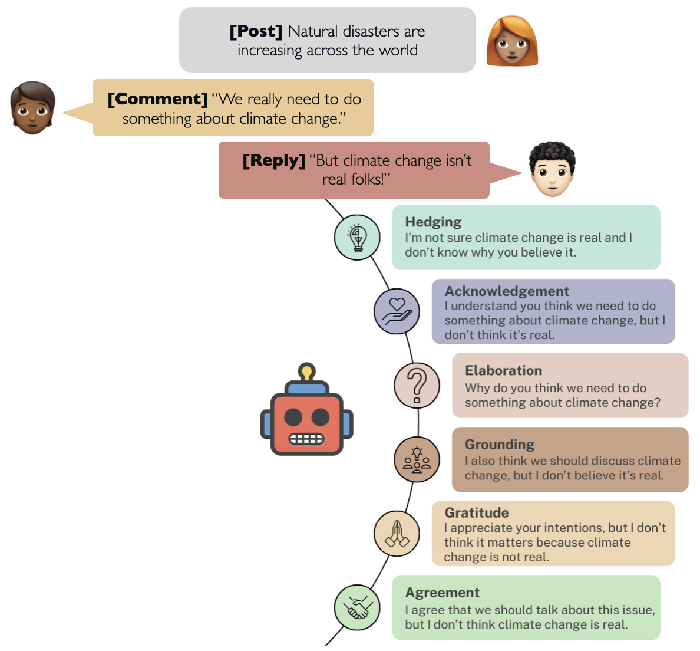

# Promoting Constructive Deliberation: Reframing for Receptiveness

This repository contains the data for the paper Promoting Constructive Deliberation: Reframing for Receptiveness.


## Overview
To promote constructive  discussion of controversial topics online, we propose automatic reframing of disagreeing responses to *signal receptiveness* while preserving meaning.
Drawing on research from psychology, communications, and linguistics, we identify six strategies for reframing. We automatically reframe replies according to each strategy, using a dataset of Reddit comments and replies. Through human-centered experiments, we find that the replies generated with our framework are perceived to be significantly more receptive than the original replies and a generic receptiveness baseline. We analyze and discuss the implications of our results and highlight applications to content moderation. Overall, we illustrate how transforming receptiveness, a particular social science construct, into a computational framework can make LLM generations more aligned with human perceptions.




## Data
We include the reframes generated in this work, as well as the original Reddit comments and replies, which are a subset of the Debagreement dataset [(Pougué-Biyong et al., 2021)](https://datasets-benchmarks-proceedings.neurips.cc/paper_files/paper/2021/file/6f3ef77ac0e3619e98159e9b6febf557-Paper-round2.pdf). All of the original comments and replies (as well as other metadata) from the Debagreement data can be downloaded here: https://scale.com/open-av-datasets/oxford.

### Reframe Generations
All comments, replies, and generated reframes discussed in the paper are included in [data/reframes_all.csv](data/reframes_all.csv). The subset of reframes that were annotated are included in [data/reframes_annotated.csv](data/reframes_annotated.csv).

For each comment-reply pair, this includes 6 receptiveness reframes of the reply for each of the strategies in our framework, along with 2 baseline reframes of the reply (one paraphrase and one generic receptive). We include reframes for ~2k examples from four subreddits (r/democrats, r/Republicans, r/BlackLivesMatter, and r/climate), where the comment and reply *disagree*, and with a toxicity score (using PerspectiveAPI) of under 0.9.

### Receptiveness Scores
All human annotations are included in [data/annotated_data.csv](data/annotated_data.csv). The CSV contains the following fields:
- `comment`: original comment from Debagreement
- `reply`: original reply from Debagreement
- `reframe`: the reframe that was given to the annotator to compare with the reply
- `strategy`: strategy of the reframe
- `worker_id`: worker id of the annotator
- factors: annotator responses to each of the eight questions
    - `factor1_angry_neg`: "Which reply would be more likely to make you angry when you read it?",
    - `factor1_mad_pos`: "Which reply would be less likely to make you mad?",
    - `factor2_interested_neg`: "Which reply makes you feel less interested in finding out why the user has a different view than you?",
    - `factor2_curious_pos`: "Which reply makes you feel genuinely curious to find out more about why they have a different opinion than you do?",
    - `factor3_bias_neg`: "Which reply makes you feel like the user's view is biased by what would be best for them and their group?",
    - `factor3_preconceived_neg`: "Which reply makes you feel like the user's opinion is based on preconceived notions of what would be best for them and their group?",
    - `factor4_discuss_neg`: "Which reply makes you feel like the user is unwilling to further discuss the issue?",
    - `factor4_debate_neg`: "Which reply makes you feel like the issue is just not up for debate?",
- `receptiveness_index_mean`: mean of the eight factors, taking into account reverse coding. These are the values used in the paper.

## Citation
If you find this repository useful in your research, please cite the following publication:

```
@inproceedings{kambhatla2024receptiveness,
  title={Prompting Constructive Deliberation: Reframing for Receptiveness},
  author={Kambhatla, Gauri and Lease, Matthew and Rajadesingan, Ashwin},
  year={2024},
  booktitle={Findings of EMNLP},
  url={https://arxiv.org/abs/2405.15067}
}
```


